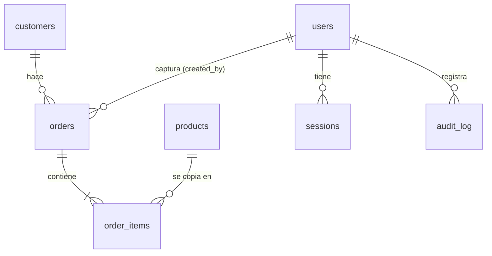

# Base de datos

Cloudflare D1 (SQLite). El esquema está en `migrations/0001_init.sql`; el menú inicial, en `migrations/0002_menu.sql`.

## Convenciones

- **Dinero en centavos** (`INTEGER`): `8500` son $85.00. Así no hay errores de redondeo con decimales.
- **Fechas de entrega** como texto `AAAA-MM-DD`: se comparan y ordenan bien como texto, y no dependen de zona horaria.
- **Marcas de tiempo** (`created_at`, `paid_at`, …) en milisegundos desde 1970.
- **Copias en los pedidos.** `order_items` guarda nombre, precio y costo del producto al momento de vender. Cambiar el
  menú no altera pedidos viejos ni reportes pasados.

## Tablas



| Tabla | Qué guarda | Campos clave |
|---|---|---|
| `users` | Personas que entran al panel | `email` único sin distinguir mayúsculas, `role` (`admin` o `staff`), `password_hash`, `disabled` |
| `sessions` | Sesiones abiertas | `id` = SHA-256 del token de la cookie (el token nunca se guarda), `expires_at` |
| `login_attempts` | Intentos fallidos por `correo\|ip` | `fails`, `first_at` |
| `products` | El menú | `id` legible (`hogaza-natural`), `price_cents`, `cost_cents` (puede ser nulo), `aliases` (JSON), `active`, `sort`, `wa_retailer_id` (id en el catálogo de WhatsApp) |
| `customers` | Clientes | `name` único sin distinguir mayúsculas, `phone`, `notes` |
| `orders` | Pedidos | `code` (folio), `customer_id`, `delivery_date`, montos en centavos, `paid`/`payment_method`/`paid_at`, `delivered`/`delivered_at`, `source` (`panel`, `whatsapp` o `excel`), `created_by` (nulo si lo creó el menú de WhatsApp) |
| `order_items` | Renglones de cada pedido | `product_id`, `name`, `qty`, `price_cents`, `cost_cents` |
| `settings` | Ajustes clave-valor | `payment_note`, `wa_menu` (`1`/`0`), `delivery_days` (`0,1,…,6`, 0 = domingo) |
| `wa_messages` | Mensajes de WhatsApp recibidos | `id` = wamid de Meta (evita duplicados), `from_phone`, `type` (`text`, `order`, `respuesta`, `otro`), `items` (JSON del carrito), `status` (`nuevo` en Bandeja, `pedido`, `descartado`, `menu` si lo atendió el menú), `order_id` |
| `wa_sessions` | Conversaciones en curso con el menú de WhatsApp | `phone`, `step`, `data` (carrito, sección, día), vence a las 2 h |
| `audit_log` | Bitácora | `at`, `user_id`, `action`, `entity`, `entity_id`, `detail` (JSON) |

## Cambiar el esquema

Nunca edites una migración que ya se aplicó. Crea una nueva con el siguiente número:

```sh
npx wrangler d1 migrations create panencia descripcion-corta   # crea migrations/0004_descripcion-corta.sql
# escribe el SQL (ALTER TABLE …, CREATE INDEX …)
npm run db:migrate:local      # pruébala en local
npm test
npm run db:migrate:remote     # aplícala en Cloudflare
```

D1 lleva la cuenta de qué migraciones ya se aplicaron en la tabla `d1_migrations`.

## Consultas útiles

```sh
# Ventas por mes
npx wrangler d1 execute panencia --remote --command \
  "SELECT substr(delivery_date,1,7) AS mes, COUNT(*) pedidos, SUM(total_cents)/100.0 AS vendido FROM orders GROUP BY mes ORDER BY mes"

# Quién debe
npx wrangler d1 execute panencia --remote --command \
  "SELECT c.name, SUM(o.total_cents)/100.0 AS debe FROM orders o JOIN customers c ON c.id=o.customer_id WHERE o.paid=0 GROUP BY c.id"
```

Sin `--remote` las consultas van contra la base local de `wrangler dev`.
