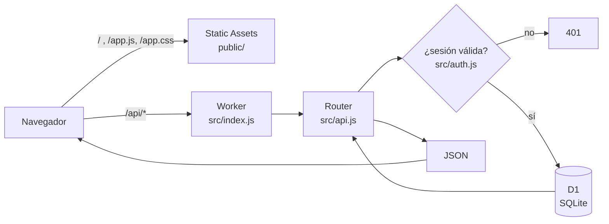

# Stack y decisiones

Panencia **no usa ningún framework**, ni de frontend (React, Svelte, Vue) ni de backend (Express, Hono).
Es JavaScript, HTML y CSS escritos a mano, que corren sobre servicios de Cloudflare. La única dependencia del
proyecto es **Wrangler**, la herramienta de línea de comandos de Cloudflare, y solo se usa para desarrollar
y publicar: no viaja al servidor ni al navegador.

## Las piezas

| Capa | Qué se usa | Dónde vive en el repo |
|---|---|---|
| Servidor | **Cloudflare Workers**: una función de JavaScript que Cloudflare ejecuta en sus servidores cada vez que llega una petición. No es Node.js: es el motor V8 (el de Chrome) con las APIs web estándar (`fetch`, `Request`, `Response`, `crypto.subtle`). | `src/` |
| Base de datos | **Cloudflare D1**: SQLite administrado por Cloudflare. Se consulta con SQL directo, sin ORM. | `migrations/` |
| Archivos del panel | **Workers Static Assets**: Cloudflare sirve `public/` tal cual; las rutas `/api/*` pasan primero por el Worker. | `public/` |
| Panel (frontend) | JavaScript sin framework: una sola página, rutas con `#/…`, el DOM se arma con una función pequeña, `el()`. La gráfica es SVG dibujado a mano. | `public/app.js`, `public/app.css` |
| Autenticación | Propia, con Web Crypto: contraseñas con PBKDF2 y sesiones en una tabla de D1. | `src/auth.js` |
| Herramientas | **Wrangler** (dev local, migraciones, deploy) y el **test runner de Node** (`node:test`) para las pruebas. | `package.json`, `test/` |
| WhatsApp | **WhatsApp Business Platform (Cloud API)** de Meta: webhook firmado para recibir, Graph API para mandar listas y botones. Sin librerías ni IA. | `src/whatsapp.js`, `src/wa-menu.js`, `src/wa-api.js` |
| Tipografías | Google Fonts: Rokkitt, Courier Prime y Atkinson Hyperlegible. | `public/index.html` |

No hay paso de compilación propio. Al publicar, Wrangler empaqueta `src/` con esbuild de forma interna y sube `public/`
sin tocarlo.

## Cómo viaja una petición

1. El navegador pide `/`. Cloudflare devuelve `public/index.html`, que carga `app.css` y `app.js`.
2. `app.js` pregunta `GET /api/me`. Si no hay sesión, muestra el login; si la hay, dibuja el panel.
3. Cada pantalla pide sus datos a `/api/...` con `fetch`. El Worker revisa la cookie de sesión, el rol y el origen,
   consulta D1 y responde JSON.
4. El panel convierte ese JSON en HTML en el navegador.

## Por qué sin framework

Cuando empezó, Panencia era una sola página HTML publicada como Artifact de Claude (`app/pedidos.html`). Al pasar a un
sistema con login y base de datos, se eligió Cloudflare porque tu sitio `prohibidoenestazona.com` ya vive ahí, el plan
gratis alcanza de sobra, y Workers + D1 dan servidor y base de datos sin administrar máquinas. Se mantuvo sin framework
por tres razones:

- **Tamaño.** Son unas 11 pantallas y 30 rutas de API. Todo el sistema cabe en unas 2 500 líneas que se leen de corrido.
- **Cero dependencias en producción.** No hay paquetes que actualizar ni vulnerabilidades heredadas; nada se rompe
  porque una librería cambió de versión.
- **Sin build.** Lo que está en el repo es exactamente lo que corre. Se puede editar `app.js` y publicar.

### Lo que se pierde

- **Componentes y reactividad.** En React o Svelte, cambiar un dato actualiza la pantalla sola. Aquí cada vista se
  vuelve a dibujar a mano (`rerender()`). Funciona bien con este tamaño, pero se vuelve pesado si el panel crece mucho.
- **Tipos.** No hay TypeScript; los errores de forma de datos aparecen en tiempo de ejecución. Las pruebas de la API
  cubren lo importante del servidor, pero el panel no tiene pruebas automáticas.
- **Convenciones conocidas.** Alguien que llega nuevo conoce SvelteKit o Next; aquí tiene que leer `app.js`.

### Si algún día conviene un framework

El backend no cambiaría: la API de `src/api.js` y la base D1 siguen sirviendo tal cual. Las rutas más naturales:

- **SvelteKit con `@sveltejs/adapter-cloudflare`.** Reescribes `public/` como componentes Svelte que llaman a la misma
  API (o mueves la API a rutas `+server.js` de SvelteKit con acceso a `platform.env.DB`). Es la opción más cercana a
  lo que hay.
- **Hono** para el backend, si las rutas crecen y el router casero de `src/api.js` se queda corto. Hono corre nativo
  en Workers y usa los mismos objetos `Request`/`Response`.

Una señal para migrar: cuando una pantalla nueva tome más de un día por pelearse con el DOM a mano, o cuando haya más
de una persona programando el panel.

## Límites del plan gratis de Cloudflare

Consulta los números actuales en la documentación de Cloudflare, porque cambian. Como referencia, el plan gratis de
Workers da del orden de 100 000 peticiones al día y D1 da varios GB de almacenamiento; un negocio con decenas de pedidos
por semana usa una fracción mínima.
