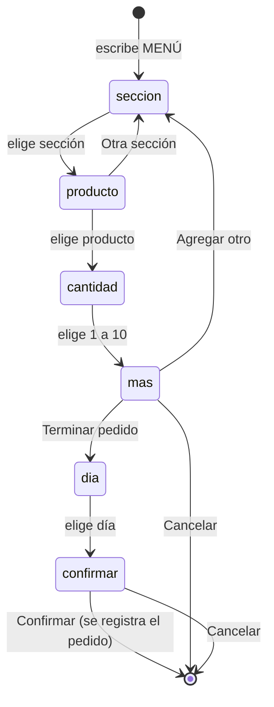
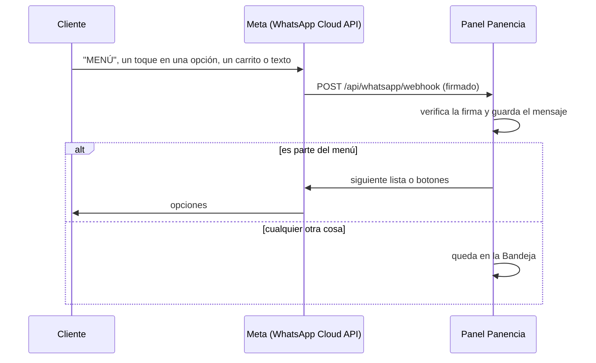

# Conectar WhatsApp

Dos formas de que los pedidos de WhatsApp entren al sistema, **ninguna usa inteligencia artificial ni adivina**:

1. **Menú de WhatsApp.** El cliente escribe `MENÚ` (o `PEDIDO`) y WhatsApp le muestra listas y botones: sección →
   producto → cantidad → ¿algo más? → día de entrega → confirmar. Cada toque trae el id exacto de la opción, así que
   el pedido que se registra es exactamente lo que el cliente eligió. Al confirmar, aparece en **Pedidos** como
   *Por cobrar* y el cliente recibe el resumen con tu mensaje de pago.
2. **Bandeja.** Todo lo demás (plática, dudas, fotos del comprobante, carritos del catálogo) llega a la Bandeja del
   panel. Los carritos del catálogo traen productos exactos y se convierten en pedido con un toque; los mensajes de
   texto no se interpretan: los lees y capturas el pedido tocando los panencios.

## El menú, paso a paso



- **Qué ve el cliente:** las secciones y productos *en venta* de Menú y costos, con su precio. Los días de entrega son
  los próximos días marcados en Menú y costos → Menú de WhatsApp, a partir de mañana (máximo 7).
- **Si escribe algo en medio**, el menú repite el paso actual; no intenta entenderlo. `CANCELAR` termina, y `MENÚ`
  empieza de nuevo.
- **Una conversación sin movimiento vence en 2 horas.** Si después toca una opción vieja, se le pide escribir MENÚ.
- **El cliente queda registrado:** si su teléfono ya está en Clientes, el pedido se le asigna; si no, se crea con su
  nombre de WhatsApp.
- **Se enciende o apaga** en Menú y costos → Menú de WhatsApp. Necesita el envío configurado (`WA_TOKEN` y
  `WA_PHONE_NUMBER_ID`).
- **Límites de WhatsApp:** 10 opciones por lista (por eso los productos van de 8 en 8 con "Ver más") y 24 caracteres
  por título (los nombres largos se recortan y el completo va en la descripción).

## Cómo llegan los mensajes



- **Carritos del catálogo:** se reconocen por el **ID en el catálogo** de cada producto (Menú y costos → columna
  "ID catálogo WA"; si la dejas vacía, se usa el id del panel, como `hogaza-natural`).
- **Fotos, audios y demás:** aparecen como `[imagen]`, `[audio]`… para que sepas que llegaron.
- **Reintentos:** si Meta manda un mensaje dos veces, se guarda y se atiende una sola vez.

## Antes de empezar: tu número

La app **WhatsApp Business** del celular no deja que otros sistemas lean sus mensajes. Para esto se usa la
**WhatsApp Business Platform (Cloud API)** de Meta, y hay que decidir qué número conectar:

- **Tu número actual, con "coexistencia".** Meta permite que un número siga funcionando en la app del celular mientras
  la API recibe copia de los mensajes. Se activa durante el registro (Embedded Signup), normalmente a través de un
  proveedor de soluciones de WhatsApp. Verifica que esté disponible para tu número y país antes de empezar.
- **Un número nuevo solo para la API.** Es lo más sencillo técnicamente, pero tus clientes tendrían que escribirle a
  otro número.

**Cuidado:** si registras tu número actual directo en la API *sin* coexistencia, deja de funcionar en la app del
celular. Confirma cómo queda antes de mover un número que ya usan tus clientes.

## Pasos

Los nombres de los menús de Meta cambian seguido; si algo no coincide, busca el equivalente en la documentación de
la WhatsApp Cloud API.

1. **Cuenta de Meta para empresas.** En [business.facebook.com](https://business.facebook.com) crea (o usa) el
   portafolio comercial de Panencia.
2. **App de Meta.** En [developers.facebook.com](https://developers.facebook.com) → My Apps → Create App, tipo
   *Business*, ligada a ese portafolio. Agrega el producto **WhatsApp**.
3. **Número.** En WhatsApp → API Setup agrega el número (ver la sección anterior). Copia el **Phone number ID**.
4. **Token permanente.** En la configuración del portafolio → Usuarios del sistema → crea uno con rol de
   administrador, asígnale la app y la cuenta de WhatsApp, y genera un token con los permisos
   `whatsapp_business_messaging` y `whatsapp_business_management`. El token temporal de API Setup vence en 24 horas;
   no lo uses.
5. **Secreto de la app.** App settings → Basic → **App secret**.
6. **Configura el Worker.** Inventa un token de verificación (cualquier texto largo) y guarda todo:

   ```sh
   npx wrangler secret put WA_VERIFY_TOKEN     # el texto que inventaste
   npx wrangler secret put WA_APP_SECRET       # paso 5
   npx wrangler secret put WA_TOKEN            # paso 4 (solo si quieres contestar desde el panel)
   ```

   En `wrangler.jsonc`, pon el Phone number ID en `vars.WA_PHONE_NUMBER_ID` y revisa que `WA_GRAPH_VERSION` sea una
   versión vigente de la Graph API. Luego aplica la migración y publica:

   ```sh
   npm run db:migrate:remote
   npm run deploy
   ```

7. **Webhook.** En la app de Meta → WhatsApp → Configuration → Webhook:
   - Callback URL: `https://<tu dominio>/api/whatsapp/webhook`
   - Verify token: el mismo `WA_VERIFY_TOKEN`
   - Verify and save, y después suscríbete al campo **messages**.
8. **Publica la app de Meta** (modo Live). En modo desarrollo solo llegan mensajes de los números de prueba.
9. **Catálogo (opcional).** Para recibir carritos, el catálogo tiene que estar conectado a tu cuenta de WhatsApp en
   Commerce Manager. En cada artículo, el **ID de contenido** debe coincidir con la columna "ID catálogo WA" del panel
   (o con el id del panel si la dejas vacía).

**Para probar:** mándate un mensaje desde otro celular al número conectado; en menos de un minuto aparece en la Bandeja.
Enciende el menú en Menú y costos y escribe `MENÚ`. Si no llega nada, revisa los logs con `npx wrangler tail`.

### Probar sin mover tu número

En la app de Meta → WhatsApp → API Setup, Meta da un **número de prueba** gratis y deja registrar hasta 5 números
destinatarios (el tuyo, el de Camila). Con ese número y el token temporal puedes probar todo el flujo (menú, bandeja,
respuestas) sin tocar el número que usan tus clientes. Cuando funcione, cambias `WA_PHONE_NUMBER_ID` y `WA_TOKEN` por
los del número real.

## Contestar desde el panel

Con `WA_TOKEN` y `WA_PHONE_NUMBER_ID` configurados, al guardar un pedido que vino de la Bandeja aparece **Enviar por
WhatsApp**, que manda el resumen (productos, total, entrega y tu mensaje de pago).

WhatsApp solo deja mandar texto libre dentro de las **24 horas** siguientes al último mensaje del cliente. Pasado ese
tiempo, el panel te pide usar el botón normal de WhatsApp (que abre el chat en tu celular). Mandar mensajes fuera de esa
ventana requiere plantillas aprobadas por Meta, y esas sí se cobran; el panel no las usa.

## Costos

Recibir mensajes no cuesta, y contestar dentro de la ventana de 24 horas tampoco. Lo que Meta cobra son las plantillas
que manda el negocio fuera de esa ventana. Las reglas y precios cambian; confírmalos en la página de precios de la
WhatsApp Business Platform.

## Seguridad

- Cada llamada de Meta trae la firma `X-Hub-Signature-256`, un HMAC-SHA256 del cuerpo con tu App secret. El panel la
  verifica y rechaza (401) lo que no esté firmado.
- El webhook es la única ruta de escritura sin sesión; no puede leer nada. Solo guarda mensajes y, si el menú está
  encendido, crea pedidos con productos del menú que estén en venta, al precio del menú.
- Los tokens viven como *secrets* de Cloudflare, nunca en el repo. Para desarrollo local usa un archivo `.dev.vars`
  (ya está en `.gitignore`).
- "Enviar por WhatsApp" solo funciona hacia números que te escribieron en las últimas 24 horas.
